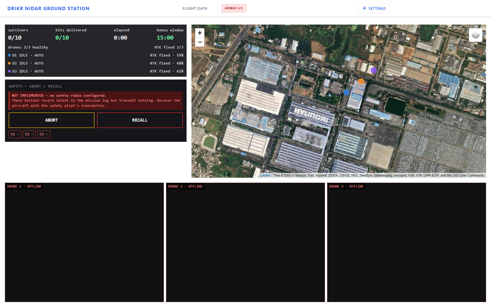
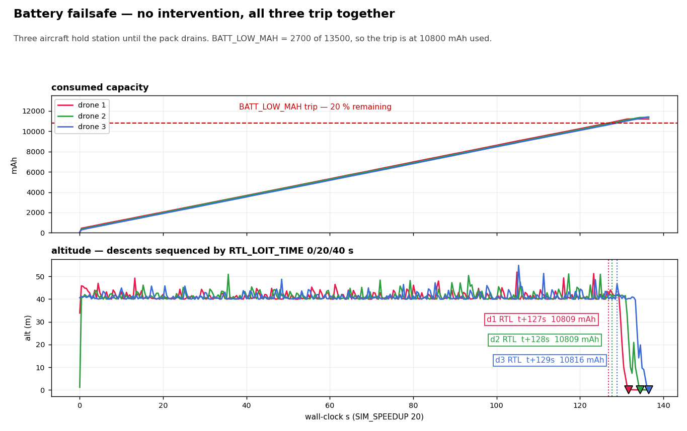
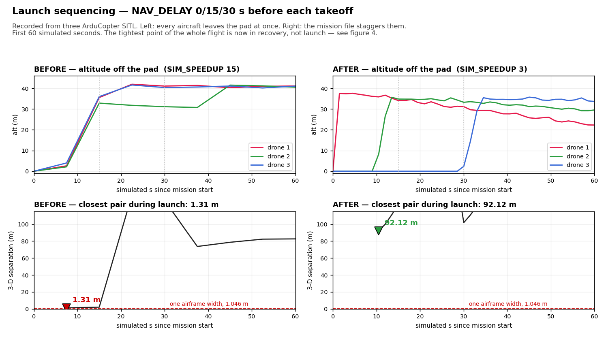
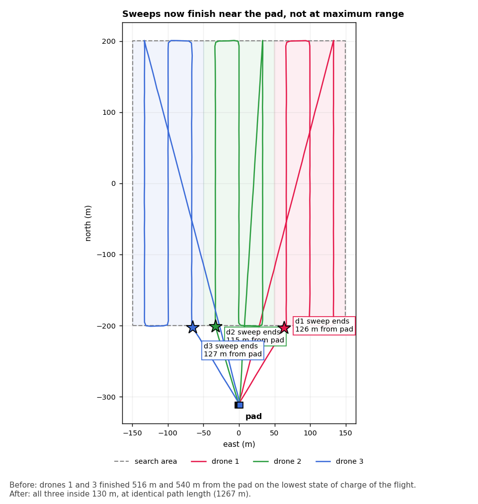
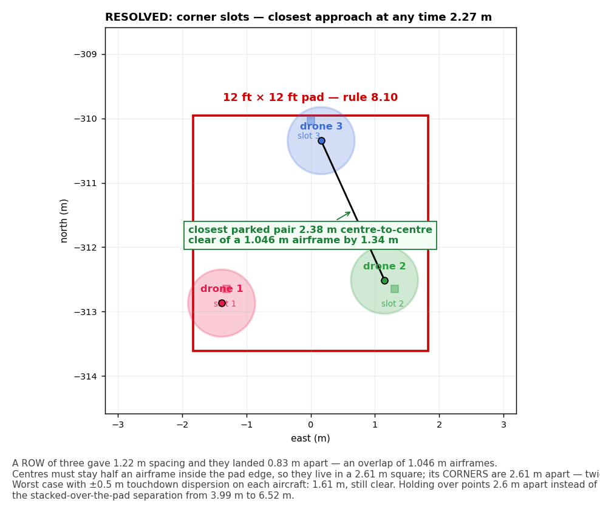

<h1 align="center">NIDAR RescueSwarm</h1>

<p align="center">
  Three autonomous drones that search a flood zone, find survivors, geotag them,<br>
  and drop medical kits — with no network, no pilot, and one operator who only presses start.
</p>

<p align="center">
  <b>NIDAR 2026–27 · Track 1 · Mission 1</b><br>
  <sub>MeitY · Drone Federation of India · SwaYaan</sub>
</p>

<p align="center">
  
  
  
  
</p>

---

## 1. Status

**Phase 0/1.** Sized end to end, requirements baselined against the rulebook, and the ground station runs as a system against three real ArduCopter SITL autopilots.

**What exists:** coverage planner, geotag geometry and its error model, ArduPilot parameter sets, safety-link protocol, ground station. All tested — 129 + 17 + 67 tests, 13 committed model outputs.

**What does not:** the aircraft, and the detector. There is **no camera anywhere in the loop**; survivors have only ever come from a simulator. Nothing has flown on hardware.

<p align="center">
  
  <br>
  <sub>Three real autopilots flying the coverage planner's output in AUTO, in 6 m/s wind, over locally cached imagery. Every number came from an autopilot.<br>
  ▶ <a href="ground-station/mission-flight.mp4">mission-flight.mp4</a> · <a href="ground-station/README.md">ground-station/README.md</a></sub>
</p>

### Next actions

| # | Action | When | Why first |
|:--|:--|:--|:--|
| 1 | [Send the organiser questions](docs/requirements/organiser-questions.md) — drafted | This week | External latency; nothing else here has any |
| 2 | Start collecting recall data | P1 | The long pole. 250 points, irreducible calendar cost |
| 3 | Bench the cold-boot timing | P1 | The only constraint under 20 % margin, still modelled |

Registration Aug 2026 · reviews Oct and Dec · **finals Jan 2027**. About 21 weeks, but monsoon and exams cut the **flight-test window to ~8 weeks**. See the [development plan](docs/development-plan.md).

---

## 2. Design point

Outputs of a closed model in [`tools/sizing-model/`](tools/sizing-model/), reconciled with the BOM to ~2 %.

| Aircraft | | Mission | |
|:--|:--|:--|:--|
| Configuration | Quadrotor · 18 in CF folding props | Design mission | **7.7 min** of 30 |
| Battery | 6S3P 21700 · 18 cells · 292 Wh | Search | 60 m AGL at 8 m/s |
| MTOW | 6.36 kg *(model)* · 6.23 kg *(BOM)* | Sweep | 93 s/drone, 10 ha over 3 |
| **Fleet** | **19.1 kg** of 25 kg — 24 % margin | GSD | 1.82 cm/px — a person is ~93 px |
| Hover | 913 W · 9.7 kg/m² disk loading | Link | ≥13 dB at 600 m · 2.5 Mbps |
| Endurance | 15.3 min — **≈2.0× the mission** ⚠ | Geotag target | CEP50 ≤ 0.75 m with RTK |
| Thrust-to-weight | 2.0 static · hover at 50 % | Delivery target | ≥60 % within 2 m, ≥30 % within 1 m |

> ⚠ **The reserve is spent.** The 300 g parachute (SYS-41) takes endurance to ≈2.0× against a self-imposed ≥2.0× policy. Any further mass growth breaks it. See [`bom_reconcile.py`](tools/sizing-model/bom_reconcile.py).
>
> **Under review:** 40 m beats 60 m — 140 px on a person instead of 93, for 2.5 min of a 15 min allowance. Pending recall measurement in P7.

---

## 3. Proof

Three ArduCopter SITL instances, the real `rescueswarm-drone{1,2,3}.parm`, the real planned missions. Every number below came off MAVLink. Telemetry is committed in [`simulations/recordings/`](simulations/recordings/); the figures redraw from it.

### 3.1 The battery failsafe brings them home

`BATT_FS_LOW_ACT = 2` had been reviewed and unit-tested for weeks, and **no simulation ever loaded the file** — every SITL script used stock defaults, where the value is `0` and a low battery does nothing at all. Now proven end to end: RTL fires at **10 809 mAh of a 10 800 mAh trip**, on all three aircraft, within two seconds of each other.



### 3.2 They no longer collide

Three defects, none visible in review, all found by running the real artifact:

- **Launches were simultaneous.** Three aircraft leaving slots 1.22 m apart measured 1.3 m from each other at 2–3 m altitude. Now `NAV_DELAY` 0/15/30 s in the mission file.
- **Two of three swept the wrong way round**, finishing 516 m and 540 m from the pad on the lowest state of charge of the flight, because sweep direction keyed on drone index. Now all three finish inside 130 m, same path length.
- **They landed on top of each other.** See §4.



| Separation, three aircraft | Before | After |
|:--|--:|--:|
| Launch, closest pair | 1.31 m | **64.80 m** |
| Whole flight, both airborne | 3.99 m | **5.51 m** |
| Closest horizontal, any time | 0.83 m — *overlap* | **1.89 m** |
| Recovery run, closest at any time | 0.83 m — *overlap* | **2.27 m** |

### 3.3 The search pattern

Each strip is swept twice, the second pass on the reverse heading, and every sweep finishes near the pad.



### 3.4 The pad



> **"Measured" means measured in simulation.** That rules out whole classes of error and none of the physical ones. [HANDOFF.md](HANDOFF.md) §2 keeps measured, modelled and assumed apart.

---

## 4. Decisions

| Decision | Outcome | Why |
|:--|:--|:--|
| Coaxial X8? | **Rejected** | +59–119 % hover power, +34–50 % fleet mass, cuts the margin to 2 %, buys no footprint back, worst attitude bandwidth tested |
| Rotor count | **Quad** | Hex/octo match or beat it on physics, but cost 1.5–2× the propulsion integration on a 21-week calendar. Decided on schedule risk, not physics |
| Prop diameter | **18 in** | Matches the BOM, and better than 20 in on descent (0.42 v_i) and gust sensitivity (0.168) |
| Thrust-to-weight | **2.0** | Tilt only reaches 12° at 15 m/s — attitude authority is never the wind limit |
| Recovery chute | **Fit one** | Cannot meet the "land on the pad" condition, but −10 beats −50, so it is worth ~40 points anyway |
| Pad layout | **Corners, not a row** | A row is the worst packing on a square. Compliance said "3 per row"; they landed **0.83 m** apart — an overlap. Corners give 2.61 m instead of 1.22 m. Measured closest approach **0.83 → 2.27 m** |
| Search pattern | **Two passes, second reversed** | Not for coverage — one pass has no gaps. Boresight bias is *systematic*, so flying the reverse heading cancels it where more frames cannot. Costs a full second sweep |
| Launch and recovery | **Sequenced in the mission file** | `NAV_DELAY` 0/15/30 s and `RTL_LOIT_TIME` 0/20/40 s — parameters, not companion code, because the failsafe RTL is a mode change inside the flight controller |
| Motor-out redundancy | **Open** | Only rotors keep the aircraft *flying and scoring*, and only rotors work in the 6 m delivery hover. Ties to rotor count |

Numbers in [configuration trade](docs/sizing/configuration-trade.md).

---

## 5. Scoring, and what reading it properly changed

**1000 points:** 600 flight · 200 design review · 200 business strategy.

| Flight — 600 | Points | | Penalty | Cost |
|:--|--:|:--|:--|--:|
| Detection + geotagging | **250** | 25 each, max 10 | Manual input or reset | −50 |
| Kit delivery accuracy | **200** | ≤1 m: 20 · ≤2 m: 14 · ≤3 m: 8 | Crash | −50 |
| Multi-drone collaboration | 50 | binary | Geofence breach | −20 |
| Single GCS interface | 50 | binary | Landing outside the box | −10/drone |
| Finish inside 15 min | 50 | binary | <sub>capped at 150</sub> | |

Three findings that moved the design more than any engineering analysis did:

- **Geolocation gates 450 of 600 points**, not 250. Kits are scored from the survivor, so a drop is never better than the tag it aimed at. RTK alone is worth 82 delivery points.
- **We were designing to the worst zone.** The old ≤3 m target scored 8 of 20 per drop; the old "90 % within 5 m" requirement sat outside every zone and would have scored nothing.
- **Speed is worth 50 points and is already won.** The bonus needs 15 min; we fly 7.7. Spend the surplus on recall — fly lower, take more looks.

Full breakdown in [rulebook compliance](docs/requirements/rulebook-compliance.md).

---

## 6. Open

| Risk | Detail | Status |
|:--|:--|:--|
| **Setup margin** | 15 s against a 5-minute rule — modelled, not measured | Recovered by SYS-42/43; bench in P1 |
| **VRS on every delivery** | 2.5 m/s descent sits at 0.48 v_i, on the vortex-ring boundary | Fix in the flight profile, not the airframe |
| **Wind cliff at 8 m/s** | Search groundspeed is 8 m/s, so at that windspeed we make no headway. Wind is natural and uncapped | Requirement: 10 m/s headway (SYS-37) |
| **Business strategy** | 200 points, barely started; sponsorship evidence cannot be produced in the final week | Start now |

Four questions are [drafted and unsent](docs/requirements/organiser-questions.md) — how "correctly geotagged" is verified, whether a canopy descent scores −10 or −50, whether motor-out tolerance is required, and whether the pad can be surveyed beforehand. The first decides whether ~1–2 m of absolute base error costs anything against 250 points. Answers already received are recorded in the same file.

---

## 7. Repository

```text
HANDOFF.md                  read this first if you are picking the project up
docs/                       requirements, sizing, business, system overview
tools/sizing-model/         the model everything traces back to
hardware/bom/               Indian BOM + indigenisation scorecard
autonomy/coverage_planner/  boundary in, one AUTO mission per drone out
perception/geotagging/      pixel to lat/lon, and a Monte Carlo of its error
firmware/ardupilot-params/  the five failsafes, as parameters not code
simulations/                SITL harness, committed telemetry, figures
```

The ground station lives in [NIDAR-GSC](https://github.com/tetraethylmethane/NIDAR-GSC) with the SITL launch scripts. `communication/` is still planned.

```bash
pip install -r tools/sizing-model/requirements.txt
python3 tools/sizing-model/rescueswarm_sizing_model.py   # the design point
python3 tools/sizing-model/bom_reconcile.py              # read before ordering

export NIDAR_SYS=$PWD
../NIDAR-GSC/scripts/test-battery-failsafe.sh            # low battery brings it home
python3 simulations/sitl/fly_and_record.py               # three aircraft fly the plan
python3 simulations/sitl/proof_figures.py                # redraw §3 from telemetry
```

`NIDAR_SPEEDUP=3` slows the sim enough to see the launch stagger. Do **not** use `NIDAR-GSC/scripts/run-sim.sh` — it launches a fixed wing with no project parameters.

> **Change the model, re-run it, commit the new output in the same commit.** Every number in this README traces to [`docs/sizing/`](docs/sizing/), and CI fails if one drifts.

| Document | What's in it |
|:--|:--|
| [Handoff](HANDOFF.md) | **Start here.** What is proven, what waits on a human, and the traps that have cost days |
| [System overview](docs/system-overview.md) | Mission flow, architecture, perception, indigenisation, failsafes |
| [Sizing calculations](docs/sizing/sizing-calculations.md) | Why every number is what it is |
| [Requirements baseline](docs/requirements/requirements-baseline.md) | Every SYS-xx requirement, traced to a rule and a verification method |
| [Rulebook compliance](docs/requirements/rulebook-compliance.md) | Rule-by-rule matrix, scoring, conflicts |
| [Development plan](docs/development-plan.md) | Schedule, critical path, risk and de-scope order |
| [Implementation plan](docs/implementation-plan.md) | What to build for autonomy, perception and failsafes — and what can be skipped |
| [Frame design constraints](docs/frame-design-constraints.md) | What CAD needs before the first part is cut |
