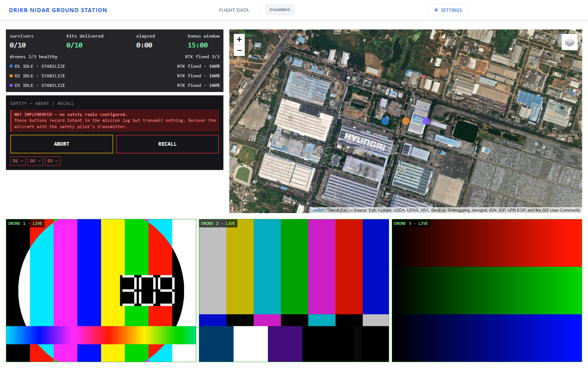

# ground-station

The **Drikr NIDAR Ground Station** — mission view, telemetry, video, abort.

Code lives in [`tetraethylmethane/NIDAR-GSC`](https://github.com/tetraethylmethane/NIDAR-GSC);
this directory holds the engineering record. Mission-build rules that must not be
undone are in [`MISSION.md`](https://github.com/tetraethylmethane/NIDAR-GSC/blob/main/MISSION.md).

Requirements: **SYS-20, SYS-23, SYS-25, SYS-26, SYS-27** — see
[`../docs/requirements/requirements-baseline.md`](../docs/requirements/requirements-baseline.md).

```bash
cd server && python -m pytest mission_tests -q      # 118 tests
python utils/slippy_map_getter.py --verify          # offline tiles intact
cd ../client && CI=true npx react-scripts test --watchAll=false   # 22 render tests
cd .. && ./scripts/check-no-network.sh              # rule 8.4 guard
node scripts/browser_check.js                       # the page, in real Chromium
```

---

## Status

| Requirement | State |
|---|---|
| No external network (SYS-23, rule 8.4) | ✅ Poller removed, CI-guarded · tiles render offline |
| No mission-altering commands (SYS-20, rule 8.16) | ✅ Legacy blueprint **not registered**; dev UI not rendered |
| Single unified interface, 3 drones (SYS-25, rule 8.13) | ✅ Verified against **three real ArduCopter autopilots** |
| All eight rule 8.14 displays (SYS-26) | ✅ Rendered and asserted in a real browser |
| Three video feeds (SYS-27, rule 8.14) | ✅ **Live H.264 over WebRTC**, end to end |
| Abort and recall (rule 8.19) | ✅ Acknowledged end to end · ⚠ **no 868 MHz radio yet** |

**118 server tests · 22 render tests · a browser check · CI on all of it.**

---

## The server had never actually started

That was the headline defect, and it was hidden by a test.

`app.py` → `apps.uav` → `handlers/uav.py` → `dronekit`, and DroneKit does
`collections.MutableMapping`, which moved to `collections.abc` in **Python
3.10**. The mission server could not boot on any current interpreter. The smoke
test had been installing a fake `dronekit` module to get around it — so the
suite passed on 3.12 while the program did not run on 3.12. A green tick over a
server nobody could start.

The fix was not to pin Python 3.9. **In a mission build the legacy `UAVHandler`
is redundant**: `mavlink_ingest.py` already carries position, mode, battery and
GNSS fix for all three aircraft over pymavlink, which DroneKit cannot do at all,
being single-vehicle by construction. Mission mode no longer imports
`apps.uav`, `apps.image` or `groundstation`, so DroneKit is **absent from the
process** rather than merely unused, and `app.gs` is `None`.

Nothing is stubbed in the smoke test any more, and it asserts
`"dronekit" not in sys.modules` directly. Absence is a fact about the running
process; "we do not call it" is only a claim about intent.

It settles SYS-20 more strongly too. The legacy blueprint's 31 routes — including
`/uav/commands/insert` and `/uav/commands/jump`, each a −50 under rule 8.16 —
are no longer in the URL map at all. Refusing a command is good; not having one
is better. The 403 guard stays as defence in depth, matching on path prefix so a
legacy path answers *"blocked in mission mode"* rather than a bare 404, which
would read as "wrong path, try another one".

Running it, for the first time:

```
GET  /                    200  Ground Station Backend
GET  /api/fleet           200  {"mission_mode":true,"phases":{"1":"IDLE",...
GET  /api/safety/status   200  {"state":"NO_RADIO","configured":false,...
POST /uav/arm             403  Blocked in mission mode
POST /uav/commands/insert 403  Blocked in mission mode
POST /api/safety/abort    503  state=NO_RADIO configured=False
dronekit in sys.modules : False        app.gs : None        python : 3.12.4
```

> **Known limitation, recorded not hidden.** The **dev** build
> (`MISSION_MODE=0`) still needs DroneKit and Python 3.9 —
> `mission_backend/dev_commands.py` is a route stub that acknowledges commands
> without sending them. Tolerable: the dev build is not the scored artefact and
> QGroundControl does bring-up better. `app.py` catches the import failure and
> prints the three options instead of a traceback about `MutableMapping`.

---

## The tile cache would have failed silently

`client/public/map` was empty, so with the network down the map is **blank** —
no boundary, no survivors, no aircraft. `slippy_map_getter.py` exists to prevent
that, and it had a defect that would only ever have surfaced on mission day.

**It wrote the response body to a `.png` without ever looking at it.** A 404
page, a rate-limit body or a truncated response landed on disk as a plausible
tile, and because the resume check was `os.path.isfile`, it was then skipped
forever. The cache would report complete, error never, and render grey squares
during a scored mission.

Every tile is now validated by magic number before it is written, written via a
temp file and rename so an interrupted run cannot leave a half-tile the resume
check trusts, and `--verify` re-checks what is already cached. **An empty cache
directory now fails verification** — the directory is created by the download
itself, so "it exists" proved nothing.

One trap found only by running it against the real server: **ArcGIS answers a
`.png` request with JPEG data.** Validating a PNG signature specifically — the
obvious way to write the check — rejects every real tile and caches nothing at
all, which is a worse failure than the original because it is total and silent.
The first version of this fix did exactly that, and downloaded 0 of 4 tiles.

It also no longer asks three interactive questions (so it can run from a script)
and no longer defaults to 38.14, −76.42, a field in Maryland left over from
AUVSI. `--dry-run` and `--verify` do not import `requests`, because needing an
HTTP library to check that *offline* tiles are intact would be a poor joke.

```bash
cd server
python utils/slippy_map_getter.py --center LAT,LON --radius-km 10 --zoom 10-18 --dry-run
python utils/slippy_map_getter.py --center LAT,LON --radius-km 10 --zoom 10-16 --yes
python utils/slippy_map_getter.py --verify
```

The dry run exists because **zoom 18 is most of the download**. Over a 10 km
radius, zoom 10–16 is ~1,700 tiles (~41 MB); adding 17 and 18 takes it to
~24,700 tiles (~600 MB) and roughly 50 minutes. Run it **weeks ahead** — the
mission area is not known until the KML arrives during setup, and there is no
network at the venue to fetch tiles with once you know where you are.

---

## The dev UI no longer renders in a mission build

`Servo`, `FlightPlanToolbar`, `Main` and the `Params` page still shipped. The
server refused them, so no rule was broken — that is not the argument. **A
control that silently does nothing is its own hazard:** under pressure someone
clicks *Write To*, sees no error, and believes the aircraft took it. The same
reasoning removed waypoint insertion from the map.

In a mission build the left column is **mission status and abort, and nothing
else**. `Params` refuses to render and says why, because `/params` is a URL and
browsers remember URLs. The legacy `/uav/quick` poll is switched off rather than
left hitting a dead path twice a second for eight minutes.

The client learns the mode from `mission_mode` on the `/api/fleet` snapshot, and
it defaults to **true** in every path — before the first poll returns, after the
backend goes away, and when the field is missing. Only an explicit `false`
unlocks anything.

Fixing this surfaced a latent bug in `useInterval`: it had no way to express
"not now", and `setInterval(fn, null)` coerces the delay to 0, which is a busy
loop rather than a stopped one. It also pinned the first render's closure
forever behind an empty dependency array, so a callback reading state saw its
initial value for the life of the component while looking perfectly correct.
Both fixed; every existing caller passes a constant delay and is unaffected.

---

## The components now actually render

Everything in `client/src/mission` had been written, compiled and shipped
**without a single component ever being mounted.** That is how two rule 8.14
displays came to be "built" while being referenced by zero files. A build proves
the syntax is valid; it proves nothing reaches a screen.

`@testing-library/react` was already in `devDependencies` and entirely unused.
**16 tests now mount `MissionStatus` and `AbortPanel` and read the resulting
DOM** — rule 8.14 items 1, 4, 6, 7 and 8 asserted as *visible text*, because a
jury looks at a screen, not at a JSON payload. Also covered: a non-RTK survivor
tag raises a visible warning; a stale display announces itself; the empty fleet
renders, which is the state at T-0 before the first MAVLink packet arrives, and
where a crash would mean a blank screen as the mission starts.

For abort specifically: no-radio reads *NOT IMPLEMENTED* rather than OK,
per-aircraft acknowledgement is displayed, and one click arms while transmitting
nothing — only the second click fires. Two-step confirm is easy to write and
easy to break; a refactor that hoists the fetch out of the confirm branch looks
harmless and turns a misclick during a nominal mission into an abort.

Writing these caught two mistakes in the *fixtures* rather than the code: a
delivery state that is not in `fleet.py`'s ladder, which would have passed
silently through a `|| state` fallback, and assertions using `getByText` where
two elements legitimately match.

**CI now runs all of it.** Nothing did before —
[`mission-build.yml`](https://github.com/tetraethylmethane/NIDAR-GSC/blob/main/.github/workflows/mission-build.yml)
runs the 107 server tests, the SYS-20 route check, `check-no-network.sh`, the
render tests and the client build, on **Python 3.12 with nothing stubbed**. It
asserts DroneKit is absent, `app.gs` is `None` and no `/uav` route exists.
Verified to *fail*: with the legacy blueprint re-registered, DroneKit reinserted
and `GroundStation` reconstructed, all three assertions trip. A guard that cannot
fail is not a guard.

---

## The coverage plan has been flown

```
coverage planner -> QGC WPL 110 -> 3 x ArduCopter SITL in AUTO -> the GCS
```

Three real ArduPilot autopilots flew the planner's own output, in wind, and
completed it:

| | result |
|---|---|
| drone 1 | **COMPLETED** — wp 9/9, max alt 40.1 m, landed on its pad |
| drone 2 | **COMPLETED** — wp 9/9, max alt 40.2 m, landed on its pad |
| drone 3 | **COMPLETED** — wp 9/9, max alt 40.1 m, landed on its pad |

6 m/s wind, turbulence 3. Nothing in the flown path was hand-written — it is
`mission.py`'s `QGC WPL 110` output, uploaded over `MISSION_ITEM_INT` (the int
variant deliberately: `MISSION_ITEM` uses float32 for latitude and quantises to
1–2 m, and the whole delivery budget is 1 m zones).

Run it with [`scripts/sim-flight.sh`](https://github.com/tetraethylmethane/NIDAR-GSC/blob/main/scripts/sim-flight.sh).

### It took seven attempts, and one of them is worth reading

Three runs were diagnosed from readings of *"alt 0.00 m, throttle 0 %, no RC"*.
None of those were measurements. The flight harness was a **passive listener**
on its private MAVLink link, so ArduPilot sent it heartbeats and nothing else,
and every variable sat at its initialised `0.0`.

That is exactly the defect found in the ground station's own ingest earlier the
same day — reproduced in the harness written to watch for it. The GCS, which
*does* request streams, was reporting the same aircraft at 40 m at the time.

**Absent data is not zero data.** Two confident wrong diagnoses were built on
that confusion, including one about RC failsafe, before `SET_MESSAGE_INTERVAL`
was added to the harness too.

The other six taught smaller lessons, all of the same shape: arming is a
request that can be *refused* (checking the ACK surfaced *"Gyros inconsistent"*
and *"AHRS: waiting for home"*); switching to AUTO does not start a mission and
`MISSION_START` returns `ACCEPTED` without starting one either; `DISARM_DELAY`
disarms the first aircraft while the third is still passing pre-arm; and
completion is *landed and disarmed*, not a mode change, because the mission
ends with RTL as an **item** so the mode stays AUTO throughout.

---

## It has now run as a system

Client, backend, **three real ArduCopter autopilots**, the mission-state feed,
the offline tile cache and MediaMTX, all at once, with a browser looking at the
result. ArduPilot SITL built from source in WSL; the prebuilt Windows binaries
are Cygwin builds that Defender blocks, and working around someone's antivirus
is not the move.



Offline satellite imagery from the local cache, three drone markers at their
distinct SITL positions, three H.264 feeds live over WebRTC, `DISARMED` correct
in the header, abort honestly reporting no radio. Zero HTTP errors, zero console
errors, zero failed requests.

Doing it found **eight defects**, none of which any existing test could have
caught.

### The big one: we were receiving almost no telemetry

ArduPilot streams at the rates set by the `SRx_*` parameters **for the channel
the GCS is on**, and a channel that has never had a stream request sends almost
nothing. Measured:

| What the GCS does | What arrives |
|---|---|
| Listen passively — **what the code did** | `HEARTBEAT` only, 1 Hz |
| + GCS heartbeat | still `HEARTBEAT` only |
| + `SET_MESSAGE_INTERVAL` | everything, at the rates asked for |

So the fleet populated with flight mode and armed state and **nothing else** —
`lat`, `lon`, `alt`, `battery_pct`, `gnss_fix` all `null`. Rule 8.14 items 3 and
4 blank for the whole mission, and the survivor fix quality unknown.

The existing tests call `handle_message()` with constructed messages. That
verifies the mapping and says nothing about whether the messages arrive.
*"We decode `GLOBAL_POSITION_INT` correctly"* and *"we receive
`GLOBAL_POSITION_INT`"* are different claims, and only a real autopilot can tell
them apart.

### The other seven

**MediaMTX had never started.** `hlsDisable`/`rtmpDisable`/`srtDisable` is the
pre-1.x spelling; MediaMTX rejects unknown fields and exits without opening a
port. Running it also caught **MoQ** — new in v1.20, on by default — quietly
opening a QUIC server and minting a TLS certificate.

**The backend URL was hardcoded** to `172.29.93.93`, a machine on the previous
team's network. Nothing could reach a backend anywhere else without editing
source and rebuilding, which is much of why client and server had never met.

**The arm badge said ARMED when nothing was armed.** `App.js` renders
`<Header />` with no props, `Aarmed` defaulted to `""`, and
`"".includes("DISARMED")` is `false` — so it showed a green ARMED with three
disarmed aircraft, and with the backend switched off. Now `NO DATA` /
`DISARMED` / `ARMED n/3`, and ARMED is no longer styled the same green as
"healthy". Armed means the propellers can spin.

**A missing route returned 500, not 404**, because the catch-all error handler
swallowed werkzeug's `HTTPException`. A 500 says the ground station is broken.

**`ref` on `MapContainer` does nothing in react-leaflet 3.2.5** — that version
uses `whenCreated`. The existing `createRef()` was a dead ref.

**The map never followed the aircraft.** It opened on a hardcoded Delhi
coordinate and stayed there — which, with tiles cached for the operating area,
renders as a grey rectangle with the boundary drawn on nothing: *the exact
appearance of a broken tile cache, produced by a completely healthy one.*

**The map polled a dev route on every mount** (`/uav/commands/export`), which is
what produced the 500.

### The abort path has now been exercised

`sim_radio.py` binds the port the GCS transmits to and decodes each frame with
the real `safety_link.protocol.Receiver` — the actual aircraft-side class, not a
mock:

| Scenario | Result |
|---|---|
| all three acknowledge | `ACKNOWLEDGED` in <1 s, 3 frames, then transmission stops |
| `--deaf 2` | `acked=[1,3] missing=[2]` held visible, `TIMEOUT` at 10 s |
| `--loss 0.5` | repeats still get all three through |

The `--deaf` case is the one worth having — it is exactly what the panel exists
to surface.

---

## What is still not done

- **The safety radio itself.** `sim_radio.py` proves the framing, sequencing,
  dedup, addressing and acknowledgement. It proves **nothing about 868 MHz** —
  not range, airtime, the LoRa module, interference or the aerial.
- **No tiles are cached for the venue.** The tooling is fixed and 681 tiles were
  cached for the test area to prove the path, but the real coordinates are not
  known and this must be run weeks ahead.
- **No real aircraft.** SITL is a genuine ArduPilot autopilot flying the real
  plan in simulated wind, but it has no radio link, no companion computer, no
  mesh, no camera and no airframe.
- **No camera anywhere in the loop.** SITL renders nothing, so the
  perception → geotag → mission-state → GCS chain has only ever been driven by
  `sim_mission.py`. Closing that needs Gazebo, which is blocked on a `sudo`
  password in WSL.
- **The measured video bitrate means nothing.** Synthetic test patterns are
  nearly static and compress to almost nothing; the 0.9 Mbps per feed in the RF
  budget is untested against real flood imagery.

Everything on that list needs hardware or a venue. **Nothing is left that can be
done at a desk** — which was not true this morning, when the list was DroneKit,
tiles, dev-UI gating, render tests, CI, SITL, MediaMTX and a browser.

The remaining ground-station work is P7–P9 field validation: attach the radio,
fly the aircraft, cache the venue, and run the pre-competition checklist with
the interfaces physically down.

---

## How it works

**Two ingest paths, deliberately separate.** MAVLink via mavlink-router carries
position, mode, battery and GNSS fix. A 5 Hz JSON document over the mesh carries
region, task, detections and deliveries — MAVLink has no message for *"survivor
at lat/lon, confidence 0.91, confirmed over 7 frames, RTK-fixed"*, and bending
`NAMED_VALUE_FLOAT` into that shape is a trap.

**Mission mode is structural, not a flag.** `MISSION_MODE=1` (the default, so the
safe build is the default) never imports the command blueprint, and refuses every
state-changing method on the legacy `/uav` routes. A flag can be flipped by a
config file; an unimported module cannot be reached.

**Survivor dedup prefers fix quality over recency.** Two aircraft can see the same
survivor, and a later `RTK_FLOAT` tag is metres worse than an earlier
`RTK_FIXED` one. Ranking is fix → frames → confidence; confidence is last because
it is worth nothing in position terms.

**Abort is the secondary path.** The primary is `RC7_OPTION=4` driving the flight
controller directly, which survives a hung companion — and a hung companion is a
reason to abort. This layer adds addressing, acknowledgement and an audit trail.

---

## Verified without hardware

`sim_mission.py` flies three synthetic drones including the awkward cases — a
drone dropping off the mesh, a survivor re-tagged with a better fix by a
different aircraft, and a tag taken without RTK. Against a real `Fleet` and a
real socket:

```
datagrams accepted : 5287      rejected : 0
survivors found    : 6         kits delivered : 6
survivor 3 fix     : RTK_FIXED (drone 3)   ← dedup preferred fix over recency
warnings           : survivor 6 tagged without RTK (3D)
```

Both safety guards were verified to **fail** when the fault is reintroduced: a
command route forced into the mission build fails three tests, and a restored
ArcGIS URL fails the network check. A guard that cannot fail is not a guard.

---

## History

The inherited codebase and the three blockers it shipped with are archived in
[`../docs/gcs-inherited-review.md`](../docs/gcs-inherited-review.md). Worth
reading before adopting any other codebase written for a different competition.
