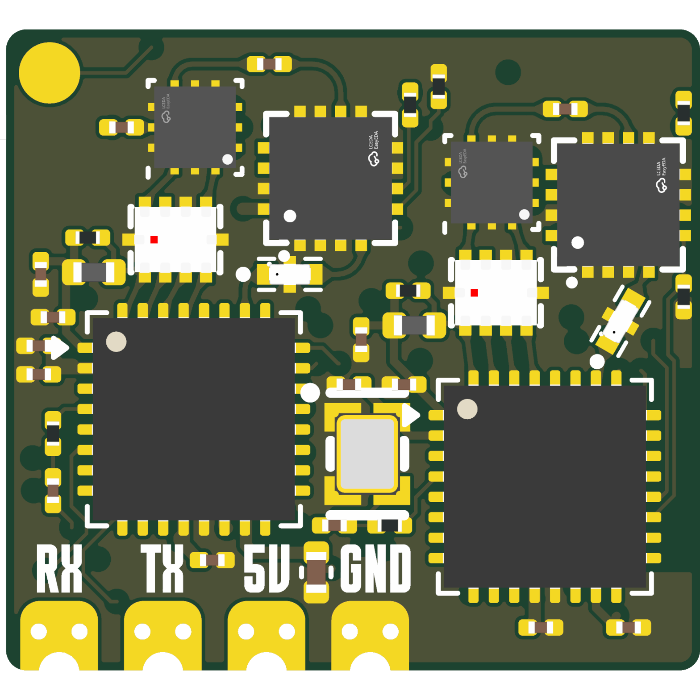
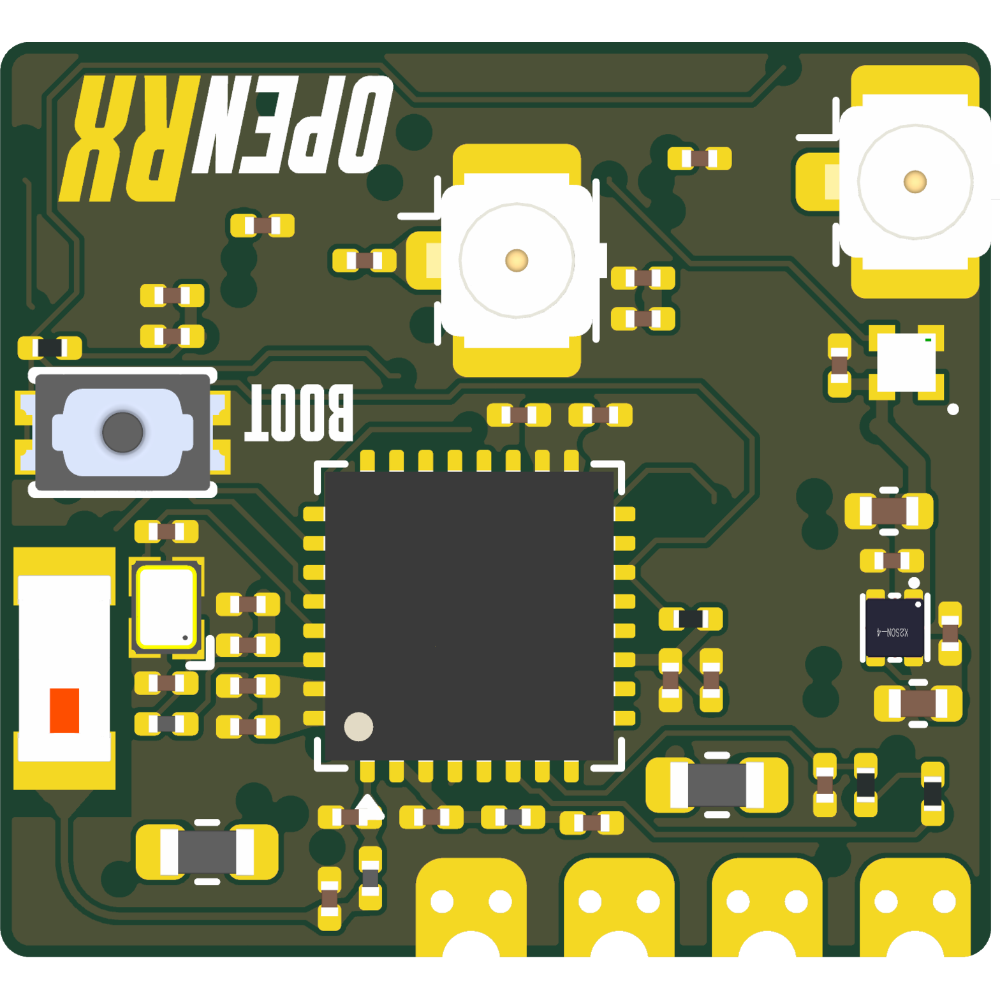

# OpenRX Gemini

Open-source dual-radio, dual-band ExpressLRS receiver for FPV aircraft. OpenRX
Gemini combines an ESP32-C3 with two LR1121 radio chains and two U.FL antenna
interfaces for Gemini and Xrossband operation.

## Specifications

| | |
|---|---|
| Band | 2.4 GHz and sub-GHz, Xrossband |
| Radios | 2x LR1121 |
| Antennas | 2x U.FL |
| Telemetry power | Up to 22 dBm (158 mW) |
| Protocol | CRSF |
| MCU | ESP32-C3 |
| Input | 5 V pad |
| Firmware | ExpressLRS |
| Flashing | Betaflight passthrough or Wi-Fi |
| Dimensions | 17.0 x 15.7 mm |
| PCB | 6-layer, 1.0 mm |

Technical write-up, part list and layout constraints: [AGENTS.md](AGENTS.md).

## In the line

What pairs with what, and what is available:
[opendrone.be](https://opendrone.be).

## Contributing

See [CONTRIBUTING.md](CONTRIBUTING.md).

## License

Hardware licensed under [CERN-OHL-S-2.0](https://ohwr.org/cern_ohl_s_v2.txt),
see [LICENSE](LICENSE).
