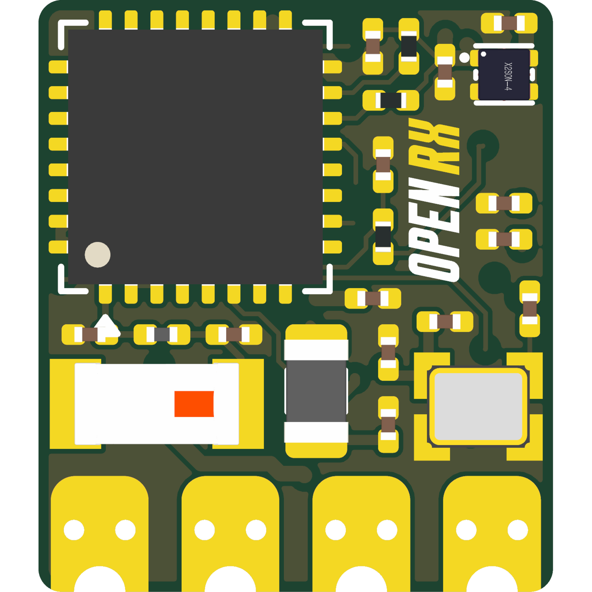

# OpenRX Lite-UFL

Open-source 2.4 GHz ExpressLRS receiver for small FPV aircraft. OpenRX Lite-UFL
combines an ESP32-C3 and SX1281 with a U.FL link-antenna connector in a
10.0 x 11.5 mm board.

## Specifications

| | |
|---|---|
| Band | 2.4 GHz |
| Radio | SX1281 |
| Antenna | U.FL |
| Telemetry power | 13 dBm (20 mW) |
| Protocol | CRSF |
| MCU | ESP32-C3 |
| Input | 5 V pad |
| Firmware | ExpressLRS |
| Flashing | Betaflight passthrough or Wi-Fi |
| Dimensions | 10.0 x 11.5 mm |
| PCB | 6-layer, 1.0 mm |

Technical write-up, part list and layout constraints: [AGENTS.md](AGENTS.md).

## In the line

What pairs with what, and what is available:
[opendrone.be](https://opendrone.be).

## Contributing

See [CONTRIBUTING.md](CONTRIBUTING.md).

## License

Hardware licensed under [CERN-OHL-S-2.0](https://ohwr.org/cern_ohl_s_v2.txt),
see [LICENSE](LICENSE).
