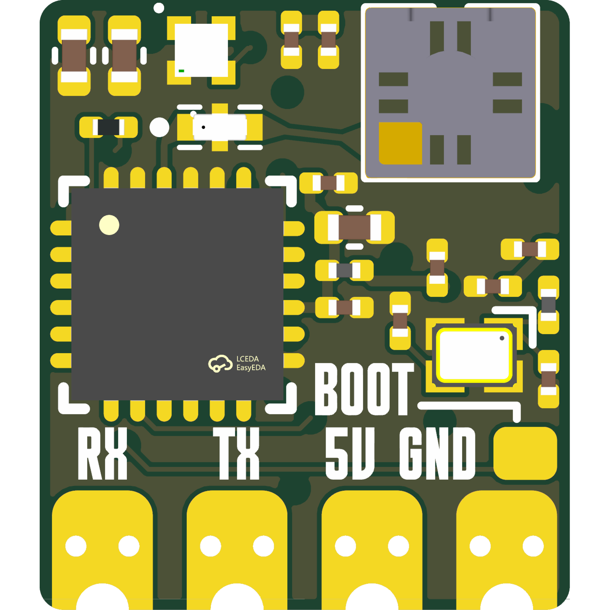
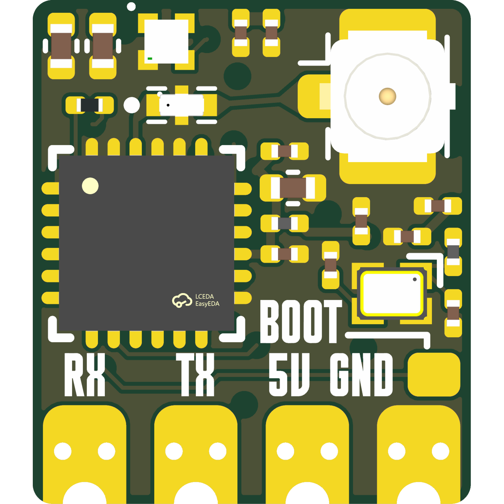
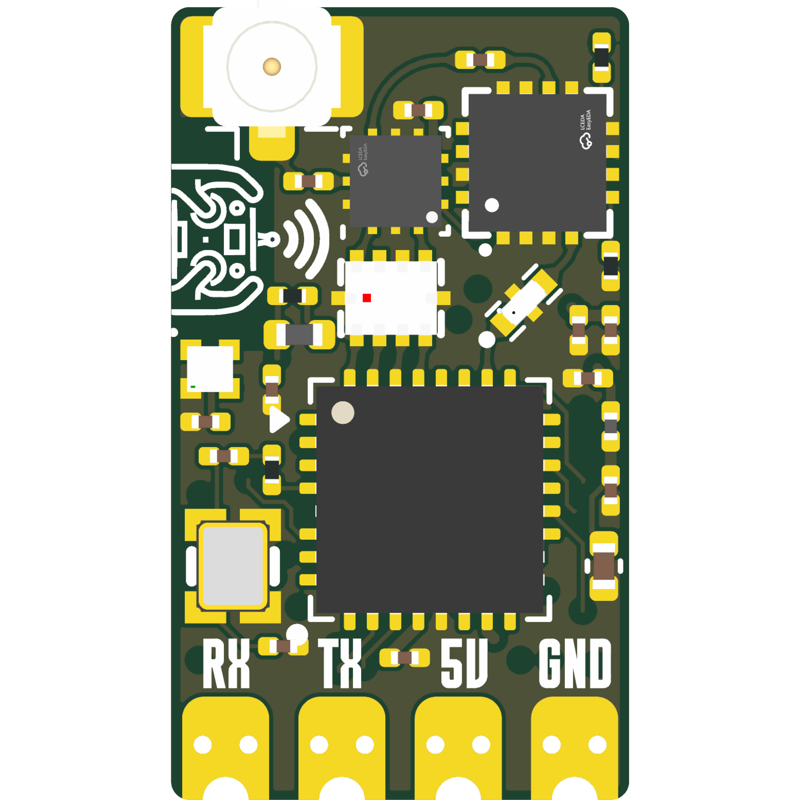

# OpenRX

OpenRX is the home of the OpenDrone open-source ExpressLRS receiver family.
The four boards now follow the same one-board-per-repository standard as the
rest of the OpenDrone hardware line. This repository remains open as the
family hub, preserving its stars, issues, releases, tags, and complete history.

## Board repositories

| Board | Radio and antenna | Source and releases |
|---|---|---|
| OpenRX Lite | SX1281, 2.4 GHz, on-board ceramic | [OpenDrone-hw/OpenRX-Lite](https://github.com/OpenDrone-hw/OpenRX-Lite) |
| OpenRX Lite-UFL | SX1281, 2.4 GHz, U.FL | [OpenDrone-hw/OpenRX-Lite-UFL](https://github.com/OpenDrone-hw/OpenRX-Lite-UFL) |
| OpenRX Mono | LR1121, dual band, one U.FL | [OpenDrone-hw/OpenRX-Mono](https://github.com/OpenDrone-hw/OpenRX-Mono) |
| OpenRX Gemini | Two LR1121 radios, dual band, two U.FL | [OpenDrone-hw/OpenRX-Gemini](https://github.com/OpenDrone-hw/OpenRX-Gemini) |

KiCad sources, firmware target definitions, board documentation, and future
releases live in those repositories. The family-level Rev 2 and Rev 2.1 tags
and releases remain here as the immutable record of the original combined
repository; their per-board assets are also available from each board repo.

## Specifications

| | Lite | Lite-UFL | Mono | Gemini |
|---|---|---|---|---|
| Band | 2.4 GHz | 2.4 GHz | Dual band | Dual band, Xrossband |
| Radio | SX1281 | SX1281 | LR1121 | 2x LR1121 |
| Antenna | On-board ceramic | U.FL | U.FL | 2x U.FL |
| Telemetry power | 13 dBm (20 mW) | 13 dBm (20 mW) | Up to 22 dBm (158 mW) | Up to 22 dBm (158 mW) |
| Protocol | CRSF | CRSF | CRSF | CRSF |
| MCU | ESP32-C3 | ESP32-C3 | ESP32-C3 | ESP32-C3 |
| Input | 5 V pad | 5 V pad | 5 V pad | 5 V pad |
| Firmware | ExpressLRS | ExpressLRS | ExpressLRS | ExpressLRS |
| Flashing | Betaflight passthrough or Wi-Fi | Betaflight passthrough or Wi-Fi | Betaflight passthrough or Wi-Fi | Betaflight passthrough or Wi-Fi |
| Dimensions | 10.0 x 11.5 mm | 10.0 x 11.5 mm | 10.0 x 17.3 mm | 17.0 x 15.7 mm |
| PCB | 6-layer, 1.0 mm | 6-layer, 1.0 mm | 6-layer, 1.0 mm | 6-layer, 1.0 mm |

OSHWA certification is issued per board:
[Lite BE000030](https://certification.oshwa.org/be000030.html),
[Lite-UFL BE000031](https://certification.oshwa.org/be000031.html),
[Mono BE000032](https://certification.oshwa.org/be000032.html), and
[Gemini BE000033](https://certification.oshwa.org/be000033.html).

## In the line

What pairs with what, and what is available:
[opendrone.be](https://opendrone.be).

## Contributing

Choose the board repository above for hardware changes. Family-wide questions
and historical discussion remain welcome here. See
[CONTRIBUTING.md](CONTRIBUTING.md).

## License

Hardware licensed under [CERN-OHL-S-2.0](https://ohwr.org/cern_ohl_s_v2.txt),
see [LICENSE](LICENSE).
